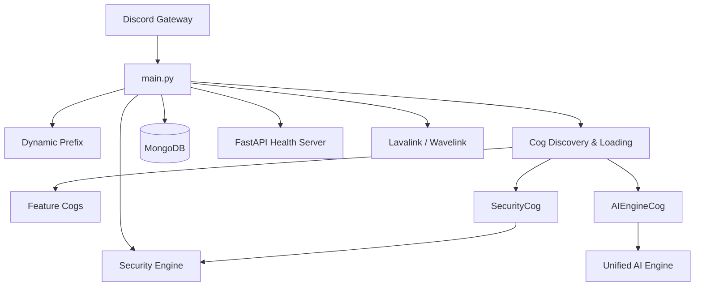
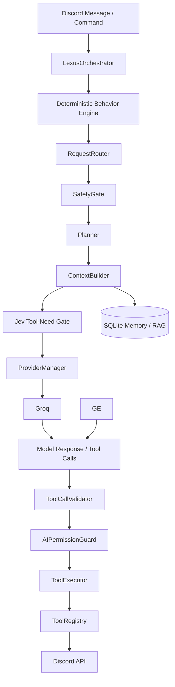
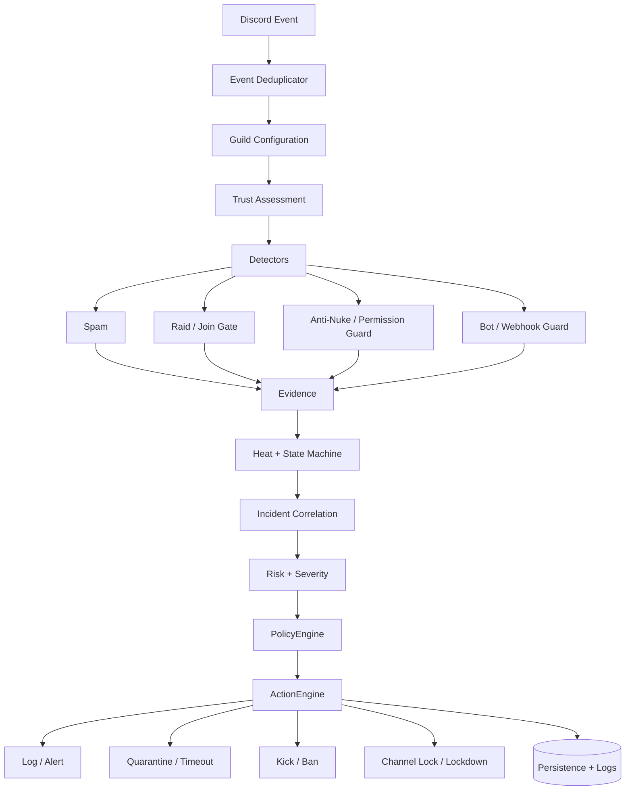

<div align="center">


# LEXUS
### Discord Automation · AI Engine · Security Engine

<p>
  <a href="https://github.com/krishna3251/lexus_dc"></a>
  
  
  
  
</p>

**Developer documentation for the current Lexus codebase**

</div>

> [!IMPORTANT]
> **Core invariant:** the AI can propose an action, but it never becomes the authority that performs it. Routing, safety, validation, permissions, hierarchy checks, policy, and execution remain application-controlled.

<div align="center">

**[Architecture](#2-architecture-at-a-glance) · [AI Engine](#5-ai-engine) · [Security](#7-security-engine) · [Cogs](#17-feature-cogs) · [Testing](#22-testing) · [Review Notes](#24-technical-review-notes)**

</div>

---

## At a Glance

| Area | Current implementation |
|---|---|
| **Bot runtime** | `main.py` + dynamic cog discovery |
| **AI** | Unified V3 engine with Groq generation, Jev typed decisions, tools, memory, lexical RAG, research |
| **Security** | V3 event pipeline with detectors, scoring, state machine, policy, actions |
| **Persistence** | MongoDB for guild/features + SQLite for AI memory/RAG |
| **Web service** | FastAPI health/stats endpoints |
| **Voice/music** | Wavelink + external Lavalink |
| **Tests** | Security, AI, RAG, research, resilience and performance suites |

> [!NOTE]
> This document describes the current main-branch implementation. It deliberately distinguishes the newer V3 systems from older/legacy AI cogs so architectural intent does not get mistaken for runtime reality.

---

## 1. Overview

Lexus is a modular Python Discord bot built around two major systems:

1. **Lexus V3 Security Engine** for deterministic server protection.
2. **Lexus AI Engine** for provider-agnostic reasoning, guarded Discord tools, memory, and live research.

The repository also contains a substantial set of legacy/feature cogs for moderation, leveling, tickets, search, AI chat, code assistance, welcome messages, autoroles, polls, reminders, and other utilities.

The most important architectural rule is:

> **Decision is separate from generation.**
>
> The high-level `LexusOrchestrator` performs the conversational lifecycle and behavioral decisioning first. `AIEngine` remains the generation/tool layer.

The AI model can interpret a request and propose a tool call, but application code remains responsible for validation, permissions, hierarchy, safety policy, execution limits, and the final Discord mutation.

### Architecture Principles

| Principle | Meaning |
|---|---|
| **Decision ≠ Generation** | Model output is input to application logic, not authority. |
| **Detection ≠ Action** | Security detectors produce evidence; policy decides what may happen. |
| **Bounded execution** | Tool calls, output size, memory, caches and action rates are capped. |
| **Failure isolation** | Provider, detector and extension failures are handled without taking down the entire bot. |
| **Audit before enforce** | Security can calculate destructive responses without applying them in audit mode. |


---

## 2. Architecture at a Glance

### 2.1 Runtime



### 2.2 AI request pipeline

The Discord-facing lifecycle now follows the Rukiya V2 separation while retaining
Lexus V3's guarded tool and provider stack:



### 2.3 Security request pipeline



---

## 3. Project Structure

```text
lexus_dc/
├── core/
│   ├── config.py
│   ├── events.py
│   ├── errors.py
│   ├── logging.py
│   ├── permissions.py
│   └── lifecycle.py
│
├── services/
│   ├── database.py
│   ├── cache.py
│   ├── snapshots.py
│   ├── orchestrator.py
│   └── ai_engine/
│       ├── __init__.py
│       ├── behavior.py
│       ├── models.py
│       ├── providers.py
│       ├── router.py
│       ├── context.py
│       ├── planner.py
│       ├── safety.py
│       ├── permissions.py
│       ├── validator.py
│       ├── executor.py
│       ├── telemetry.py
│       ├── tools.py
│       ├── engine.py
│       ├── memory.py
│       ├── research.py
│       ├── embeddings.py
│       ├── rag.py
│       └── personality.py
│
├── security/
│   ├── engine.py
│   ├── models.py
│   ├── scoring.py
│   ├── event_tracker.py
│   ├── spam.py
│   ├── raid.py
│   ├── join_gate.py
│   ├── anti_nuke.py
│   ├── permission_guard.py
│   ├── bot_guard.py
│   ├── webhook_guard.py
│   ├── quarantine.py
│   ├── lockdown.py
│   ├── baseline.py
│   ├── recovery.py
│   ├── audit.py
│   ├── actions.py
│   ├── incidents.py
│   ├── dedup.py
│   ├── policies.py
│   └── simulator.py
│
├── cogs/
│   ├── security.py
│   ├── ai_engine.py
│   ├── chat_lex.py
│   ├── coder_lex.py
│   ├── moderation.py
│   ├── automod.py
│   ├── anti_nuke.py
│   ├── quarantine.py
│   ├── tickets.py
│   ├── welcome.py
│   ├── leveling.py
│   ├── autorole.py
│   ├── reminders.py
│   ├── polls.py
│   ├── search.py
│   ├── perspective.py
│   ├── logging_cog.py
│   ├── server_stats.py
│   ├── serverinfo.py
│   ├── minfo.py
│   ├── invite_cog.py
│   ├── prefix_cog.py
│   ├── broadcast.py
│   ├── gif_cog.py
│   ├── channel_perms.py
│   ├── purge_member_cog.py
│   ├── mass_role_add_cog.py
│   ├── slash_commands_cog.py
│   └── help.py
│
├── tests/
├── api.py
├── main.py
├── mongo_helper.py
├── stats_store.py
├── requirements.txt
├── SECURITY.md
└── LICENSE
```

---

> [!IMPORTANT]
> **Public repository boundary:** Lexus is a private, non-self-hostable project. This repository is for documentation, technical reference, architecture, feature showcase, and development history. Installation, deployment, credential setup, environment-variable instructions, and self-hosting procedures are intentionally omitted.


---

## 4. Core Runtime

## 4.1 `main.py`

`main.py` is the application entry point.

Responsibilities:

- Load environment variables.
- Require `DISCORD_TOKEN`.
- Configure console + file logging.
- Initialize the Discord bot with message-content, guild, and member intents.
- Resolve a per-guild command prefix from MongoDB when available.
- Dynamically discover and load Python cogs.
- Start the V3 security health report.
- Rotate Discord presence every five minutes.
- Start FastAPI in a background thread.
- Connect to Lavalink through Wavelink.
- Sync slash commands on `on_ready`.
- Retry bot startup up to five attempts on connection/API failures.
- Gracefully stop the security engine and MongoDB client on shutdown.

Security/help/admin/core-prefixed cogs are loaded before the remaining cogs. Each extension is isolated during startup, so one failed cog does not stop all other extensions from loading.

The default prefix is `lx `, and direct bot mentions are also accepted.

---

---

## 5. AI Engine

## 5.1 Unified AI models

The V3 AI engine defines:

- `AIProvider`: `groq`, `gemini`
- `AIIntent`: `chat`, `server_query`, `security_query`, `action_request`, `help`, `search`, `unknown`
- **Jev decision layer:** separate typed evaluation service for narrow decisions; it is not part of the generative provider enum.

Requests and results use dataclasses so routing decisions, provider replies, tool calls, and errors have explicit structures.

## 5.2 Request routing

`RequestRouter` performs deterministic pattern-based classification before a model is called.

| Intent | Tools | Mutations |
|---|---:|---:|
| Chat | No | No |
| Server query | Yes | No |
| Security query | Yes | No |
| Help | Yes | No |
| Search | Yes | No |
| Action request | Yes | Yes |
| Unknown/empty | No | No |

The router creates an execution plan. It does not directly perform Discord actions.

## 5.3 Execution planning

| Request class | Max iterations | Max tool calls | Mutations |
|---|---:|---:|---:|
| Action request | 4 | 8 | Yes |
| Server/security/help/search | 4 | 6 | No |
| Normal chat | 2 | 0 | No |

Tool outputs are also bounded before being returned to the model.

## 5.4 Safety gate

The safety layer blocks:

- secret-exfiltration requests
- security-bypass attempts
- bulk mutation requests classified as action requests

## 5.5 Permission layers

AI mutations pass several independent boundaries.

1. **Execution plan:** the route must allow mutations.
2. **Tool permission:** the tool declares a Discord permission.
3. **Target protection:** server owner, bot, and hierarchy-protected targets cannot be acted on.
4. **Protected channels:** security-protected channels and the security log channel cannot be modified through AI tools.

The authority model is:

```text
Model proposes
    -> Application validates
    -> Discord permissions constrain
    -> Executor performs
```

## 5.6 AI tools

### Read

| Tool | Purpose |
|---|---|
| `get_server_overview` | Basic live server information |
| `get_member` | Resolve and inspect one member |
| `list_channels` | List server channels |
| `list_roles` | List roles and hierarchy |
| `get_bot_status` | Latency, guild count, uptime |
| `get_security_status` | Security mode, heat, state, protection switches |
| `get_recent_security_incidents` | Read recent incidents |
| `get_recent_audit_logs` | Inspect audit events; requires View Audit Log |

### Mutating

| Tool | Required permission | Purpose |
|---|---|---|
| `timeout_member` | Moderate Members | Timed moderation |
| `kick_member` | Kick Members | Remove member |
| `ban_member` | Ban Members | Ban member |
| `lock_channel` | Manage Channels | Deny @everyone Send Messages |

## 5.7 Tool execution

`ToolCallValidator` checks tool existence, mutation policy, JSON serializability, and bounded argument size.

`ToolExecutor` adds:

- call fingerprinting
- duplicate suppression
- execution timeout
- structured failure results

## 5.8 Provider layer

The unified provider manager uses OpenAI-compatible adapters with strict generation priority:

| Layer | Current default |
|---|---|
| Primary generation | Groq · `openai/gpt-oss-120b` |
| Generation fallback | Gemini · `gemini-3.8-flash` |
| Decision layer | Jev · `typesafe-ai/jev` through Vercel AI Gateway |

Groq remains first for generation. A previous cooldown does not silently promote Gemini. Jev is a separate decision path and never becomes a generation fallback.

Transient generation failures can place a provider into cooldown. The current default cooldown is 300 seconds.

### Unified vs legacy AI

The unified `services/ai_engine/` path currently uses Gemini and Groq.

The repository also contains older AI paths, notably `chat_lex.py` and `coder_lex.py`, which still use other integrations such as OpenRouter and NVIDIA. Those should not be confused with the V3 provider manager.

---

## 5.9 Jev Decision Layer

`services/ai_engine/jev.py` is a deliberately separate decision service.

```text
Read-oriented request
       │
       ▼
Jev
       │
       ├── "live Discord tools required" → continue with tool schemas
       └── "not required" → omit live tool schemas
```

The gate is conservative. Lexus only disables live Discord tools when Jev assigns a very low probability that they are needed. If Jev is unavailable, times out, or returns an unusable answer, the deterministic planner remains unchanged.

The service also provides:

- typed Boolean / Choice / Score evaluation
- bounded decision state
- short-lived result caching
- transient-failure cooldown
- response normalization
- no Discord mutation authority

The design follows the core invariant:

> **Jev decides; Lexus policy still authorizes and executes.**

`AI_GATEWAY_API_KEY` is intentionally not documented here because this public repository does not provide installation or credential-configuration instructions.

## 6. AI Memory and Research
## 6.1 SQLite memory

`AIMemoryService` uses local SQLite for AI memory so the V3 AI subsystem does not depend on MongoDB.

Default:

```text
/home/container/data/lexus_ai.sqlite3
```

Environment:

```env
AI_SQLITE_PATH=/home/container/data/lexus_ai.sqlite3
```

The store includes:

- bounded conversation history
- durable key/value memories
- message deduplication

Default bounds are 12 conversation turns and 12 durable memories.

## 6.2 RAG

`RAGStore` uses the same SQLite database and stores optional embeddings as compact float32 blobs.

Retrieval combines:

- semantic cosine similarity
- lexical overlap
- freshness
- source quality

The RAG store is bounded by a maximum item count.

## 6.3 Embeddings

Gemini embeddings are used when configured:

```env
GEMINI_EMBEDDING_MODEL=gemini-embedding-2
GEMINI_EMBEDDING_DIMENSIONS=768
```

## 6.4 Research pipeline

The research coordinator follows this general order:

1. deterministic query planning
2. local RAG recall
3. Groq browser search as the primary live path
4. Gemini Google grounding as the live-search fallback
5. Google Custom Search, when available
6. cached RAG-only answer when live research is unavailable

Sources are deduplicated and quality ordered. For current/news requests the research instructions prefer multiple reputable sources and primary sources when available.

---

---

## 7. Security Engine

## 7.1 Per-guild configuration

Security configuration contains:

- enabled switch
- mode
- profile
- quarantine role
- security log channel
- security admin role
- trusted users and roles
- trusted bots
- protected roles and channels
- action budget
- detector toggles
- custom thresholds

### Profiles

```text
STANDARD
STRICT
CUSTOM
```

### Modes

```text
audit
enforce
```

In audit mode destructive actions are simulated/logged. In enforce mode policy-selected containment actions can be executed.

---

## 8. Security Detection Modules

| Module | Primary role |
|---|---|
| Anti-spam | Burst, repetition, mention/link/attachment flooding, channel hopping |
| Raid detector | Join-rate and distributed message patterns |
| Join gate | New/suspicious account signals during member joins |
| Anti-nuke | Channel/role and other structural abuse |
| Permission guard | Dangerous role-permission escalation |
| Bot guard | Unauthorized/high-risk bot additions |
| Webhook guard | Suspicious webhook activity |

Detector failures are isolated inside the security event pipeline so one broken detector does not stop processing.

---

## 9. Security Heat and State Machine

## 9.1 Heat

The engine maintains decaying:

- guild heat
- raid heat
- structural heat
- actor heat
- channel heat

Current half-lives:

| Heat | Half-life |
|---|---:|
| Guild | 45 s |
| Raid | 60 s |
| Structural | 30 s |
| Actor | 30 s |
| Channel | 20 s |

The implementation uses bounded TTL caches for per-actor and per-channel state.

## 9.2 States

```text
NORMAL
ELEVATED
RAID
PANIC
RECOVERY
```

Current transition thresholds:

| Transition | Threshold |
|---|---:|
| Elevated enter | 40 |
| Elevated exit | 20 |
| Raid suspected | 50 raid heat |
| Raid enter | 80 raid heat |
| Raid exit | 40 raid heat |
| Panic enter | 85 structural heat |
| Panic exit | 30 structural heat |

State down-shifts have a minimum dwell time of five seconds.

---

## 10. Trust Model

Possible actor trust levels:

```text
OWNER
TRUSTED
STAFF
MEMBER
NEW_MEMBER
UNKNOWN
SUSPICIOUS
QUARANTINED
```

Trust is derived from owner status, trusted-user/role configuration, staff permissions, quarantine state, and join age.

Current risk multipliers:

| Trust | Multiplier |
|---|---:|
| OWNER | 0.10 |
| TRUSTED | 0.30 |
| STAFF | 0.50 |
| MEMBER | 1.00 |
| UNKNOWN | 1.15 |
| NEW_MEMBER | 1.25 |
| SUSPICIOUS | 1.50 |
| QUARANTINED | 1.80 |

---

## 11. Risk and Severity

Risk combines evidence score, confidence, trust, cross-detector correlation, and active raid state. The final value is bounded to 0-100.

| Risk range | Severity |
|---:|---|
| 0-24.99 | INFO |
| 25-44.99 | LOW |
| 45-64.99 | MEDIUM |
| 65-84.99 | HIGH |
| 85-100 | CRITICAL |

Multiple detectors can increase correlation risk when an incident spans more than one signal source.

---

## 12. Security Policy

The policy layer converts risk/severity/trust/state into action types.

- **Owner activity:** log only.
- **Trusted/staff non-structural activity:** log, and alert at higher severity.
- **Critical structural incidents:** in enforce mode, sufficiently confident incidents can quarantine and, under panic/high-risk conditions, lock down the guild.
- **Critical general incidents:** in enforce mode, sufficiently confident incidents can quarantine.
- **High severity:** suspicious/new/unknown actors can be quarantined; other actors can be timed out.
- **Medium severity:** suspicious/new actors can be timed out; strict profile can expand timeout behavior.
- **Low severity:** observational logging.

Audit mode prevents real destructive mutations even when policy calculates them.

---

## 13. Action Engine

Supported security actions include:

- log
- alert
- timeout
- quarantine
- kick
- ban
- channel lock
- guild lockdown

Mutation execution includes:

1. action-budget check
2. circuit breaker
3. permission checks
4. hierarchy checks
5. idempotency where implemented
6. structured failure logging

Default action budget:

```text
10 actions / 10 seconds
```

The point is to keep an incident response from accidentally becoming an API-rate-limit speedrun.

---

## 14. Quarantine, Lockdown, Baseline, Recovery

## Quarantine

`QuarantineManager` can create/ensure the quarantine role, contain a member by changing roles, and later restore the member's previous roles.

## Lockdown

`LockdownManager` handles emergency guild lock state.

## Baseline

`BaselineManager` captures trusted role/channel structure.

Baseline changes are blocked during RAID, PANIC, and RECOVERY to avoid treating compromised structure as known-good structure.

## Recovery

`RecoveryEngine` compares the current server against the trusted baseline and reports:

- deleted roles
- deleted channels
- modified roles
- modified channels

The current recovery implementation includes conservative restoration of deleted channels. It is not an unrestricted full-server reconstruction engine.

---

## 15. Security Commands

The security cog exposes:

| Command | Purpose |
|---|---|
| `/security status` | State, mode, profile, modules, heat |
| `/security setup` | Configure log/quarantine resources and capture a baseline |
| `/security config` | Set audit/enforce mode and profile |
| `/security logs` | View recent incidents |
| `/security trust` | Manage trusted users/roles |
| `/security quarantine` | Manually quarantine/release a member |
| `/security lockdown` | Enable/release emergency lockdown |
| `/security baseline` | Capture or diff the trusted structure |
| `/security recovery` | Analyze structural damage |

Typical initial workflow:

```text
/security setup
/security config mode:audit
/security status
```

---

## 16. Unified AI Commands

```text
lx ask <prompt>
/ask <prompt>
lx aistatus
lx aireload
```

The status/reload commands are owner-only.

---

---

## 17. Feature Cogs

The repository currently contains 29 Discord cogs.

| Cog | Responsibility |
|---|---|
| `security.py` | V3 security administration and event forwarding |
| `ai_engine.py` | Unified V3 AI interface |
| `chat_lex.py` | Legacy conversational AI and behavioral sessions |
| `coder_lex.py` | Legacy code generation/review/analyze workflow |
| `moderation.py` | Kick, ban, timeout, moderation panel |
| `automod.py` | Bad words, spam, caps, invite filters |
| `anti_nuke.py` | Legacy anti-nuke controls |
| `quarantine.py` | Manual/triggered quarantine workflow |
| `tickets.py` | Support tickets/private threads |
| `welcome.py` | Welcome/goodbye/DM messages |
| `leveling.py` | XP, rank, leaderboard |
| `autorole.py` | Auto-role and reaction-role |
| `reminders.py` | Persistent reminders |
| `polls.py` | Reaction polls and auto-close |
| `search.py` | Google, YouTube, weather |
| `perspective.py` | Toxicity analysis and karma |
| `logging_cog.py` | Delete/edit/member logging |
| `server_stats.py` | Cached server statistics |
| `serverinfo.py` | Server information |
| `minfo.py` | Member/moderator/user information |
| `invite_cog.py` | Bot/support/GitHub invite surface |
| `prefix_cog.py` | Per-guild prefix |
| `broadcast.py` | Channel broadcasting |
| `gif_cog.py` | Smart GIF/AI pinger |
| `channel_perms.py` | Channel/role permission controls |
| `purge_member_cog.py` | Per-user message purge |
| `mass_role_add_cog.py` | Mass role operations |
| `slash_commands_cog.py` | Common moderation utilities |
| `help.py` | Interactive help and AI-assisted help |

---

## 18. Key User-Facing Commands

### Moderation

```text
setmodrole
givemod
kick
ban
timeout
moderate

/kick
/ban
/timeout
/moderate
```

### Configuration/features

```text
/automod
/badwords
/ticket
/setwelcome
/setgoodbye
/setwelcomedm
/rank
/leaderboard
/setautorole
/removeautorole
/reactionrole
/remind
/reminders
/poll
```

### Utility

```text
pinginfo
lockdown
unlockdown
slowmode
purge
purgeuser
setprefix
prefix
resetprefix
invite
netdata
netizens
netrunners
netprofile
```

The search cog provides hybrid commands for weather, YouTube, and Google search.

---

## 19. Persistence

## MongoDB

MongoDB is used by many feature cogs and by the security persistence layer.

Known collections/access patterns include:

```text
guild_config
antinuke
warnings
karma
levels
security_config
security_incidents
```

MongoDB is optional. The helper disables Mongo-backed functionality cleanly when no valid connection exists, while the security database service keeps in-memory fallbacks for selected operations.

## SQLite

SQLite is used by the V3 AI memory/RAG stack.

The split is intentional:

```text
MongoDB -> guild/feature persistence
SQLite   -> AI memory + RAG
```

---

## 20. FastAPI Health Service

Available endpoints:

| Endpoint | Method | Purpose |
|---|---|---|
| `/` | GET/HEAD | Basic OK response |
| `/health` | GET | Health response |
| `/stats` | GET | Cached bot/server statistics |

When `API_SECRET_KEY` is configured, `/stats` can require the `X-API-Key` header.

Default API port:

```text
10000
```

The health server is intended to support hosting-platform health checks.

---

## 21. Public Repository Boundary

Lexus is intentionally documented as a **private, non-self-hostable project**.

This repository does not publish:

- installation commands
- deployment instructions
- environment-variable or credential setup
- secret-management walkthroughs
- local runtime instructions
- hosting-platform setup

The source may be inspected for architecture and technical reference, but the public documentation is not an installation guide.

---
## 22. Testing

The repository includes tests for both the security engine and AI subsystem.

### Security coverage

- sliding windows
- token buckets
- heat decay
- dangerous permissions
- event deduplication
- state hysteresis
- risk calculation
- spam bursts/repetition
- mention/link/attachment flooding
- raid patterns
- anti-nuke escalation
- bot guard
- webhook bursts
- audit vs enforce mode
- database-offline fallback
- hierarchy failures
- owner protection
- detector exception isolation
- task shutdown
- throughput and memory boundedness

### AI coverage

- tool loops
- unknown tool rejection
- explicit search routing
- empty prompt handling
- read-only routing
- secret-exfiltration blocking
- bulk mutation blocking
- current-price search routing
- memory round-trip/deduplication
- memory bounds
- research query freshness
- bounded deep research
- RAG lexical retrieval
- Jev answer normalization and validation
- Jev result caching
- Jev conservative tool-need gating

Run:

```bash
python -m unittest discover -s tests -p "test_*.py"
```

Compile before deployment:

```bash
python -m compileall .
```

---

## 23. Development Rules

## AI

- Never let model output directly authorize a Discord mutation.
- Keep Jev decisions separate from generative provider routing.
- Treat Jev as a decision signal, never as permission.
- Keep routing, safety, validation, permissions, and execution separate.
- Keep tool arguments and outputs bounded.
- Preserve provider failure visibility.
- Preserve request/tool deduplication.
- Treat retrieved memory and external research as untrusted data, not instructions.

## Security

- Keep detectors isolated.
- Preserve hierarchy and owner protections.
- Keep action budgets/circuit breakers enabled.
- Do not overwrite baselines during threat states.
- Prefer idempotent actions.
- Keep audit mode non-destructive.
- Preserve hysteresis in state transitions.

---

---

## 24. Technical Review Notes

## 24.1 Security mode is split across configuration layers

`CoreConfig` reads process-level `SECURITY_MODE` with an `audit` default.

`GuildSecurityConfig`, which is actually used by `SecurityEngine.get_guild_config()`, has a dataclass default of `enforce`.

**Operational implication:** do not assume the environment variable changes every guild's active security mode. Configure and verify the guild explicitly with:

```text
/security config
/security status
```

## 24.2 Provider priority and model configuration

The unified provider manager uses Groq as the sole model provider.

Jev does not belong in this generation provider chain. It is isolated in `services/ai_engine/jev.py` and uses the separate AI Gateway evaluation endpoint.

## 24.3 V3 AI, Jev, and legacy AI are separate paths

The repository contains a modern unified AI engine and several older AI implementations. Full migration has not happened yet, so changes to one path do not automatically affect the others.

## 24.4 Member mention parsing should be corrected

`services/ai_engine/tools.py` currently contains a mention pattern equivalent to:

```python
r"<@!?(d+)>"
```

For numeric Discord IDs the intended expression appears to be:

```python
r"<@!?(\d+)>"
```

Direct numeric member ID handling exists elsewhere, but mention parsing should receive a regression test.

## 24.5 Lavalink fallback password

`main.py` includes a fallback Lavalink password when the environment value is absent. Production deployments should always provide an explicit secret.

## 24.6 Documentation alignment

The README is visually polished and communicates the intended architecture, but it does not fully separate the unified V3 AI stack from the legacy AI cogs and contains the provider-model documentation mismatch noted above.

---

---

## 25. Recommended Development Order

For security changes:

```text
Core event/model
    -> detector
    -> evidence
    -> heat
    -> state
    -> risk
    -> policy
    -> action
    -> test
```

For AI changes:

```text
Intent
    -> router
    -> planner
    -> tool/schema
    -> safety
    -> validator
    -> permission guard
    -> executor
    -> test
```

This keeps new behavior inside the same authority boundaries instead of creating another clever shortcut that eventually becomes production archaeology.

---

---

## 26. Architecture Summary

Lexus is currently a hybrid codebase:

- **Modern core:** V3 Security Engine and V3 AI Engine.
- **Feature layer:** 29 Discord cogs with a mix of modern and legacy implementations.
- **Persistence split:** MongoDB for broad bot/guild data; SQLite for AI memory/RAG.
- **Runtime:** Discord bot plus optional FastAPI and Lavalink services.
- **AI authority model:** the model proposes, application code validates and executes.
- **Security authority model:** detectors provide evidence, policy decides, action engine enforces.
- **Testing:** unit, integration, resilience, performance, AI safety, memory, RAG, and research tests.

The core invariant to preserve is:

```text
AI proposes
Application validates
Discord permissions constrain
Policy decides
Executor mutates
Telemetry records
```

That boundary is the foundation for safely migrating the remaining legacy AI functionality into the unified engine.

---

## Source Files Worth Reading First

<details>
<summary><strong>Open the recommended reading order</strong></summary>

```text
01  main.py
02  core/events.py
03  security/models.py
04  security/engine.py
05  security/policies.py
06  security/actions.py
07  services/ai_engine/models.py
08  services/ai_engine/router.py
09  services/ai_engine/engine.py
10  services/ai_engine/tools.py
11  services/ai_engine/memory.py
12  services/ai_engine/research.py
```

</details>

<div align="center">

**Lexus · AI Engine · Security Engine · Discord Automation**

<sub>Documentation generated from repository source review. Keep this file aligned with the implementation as V3 evolves.</sub>

</div>
